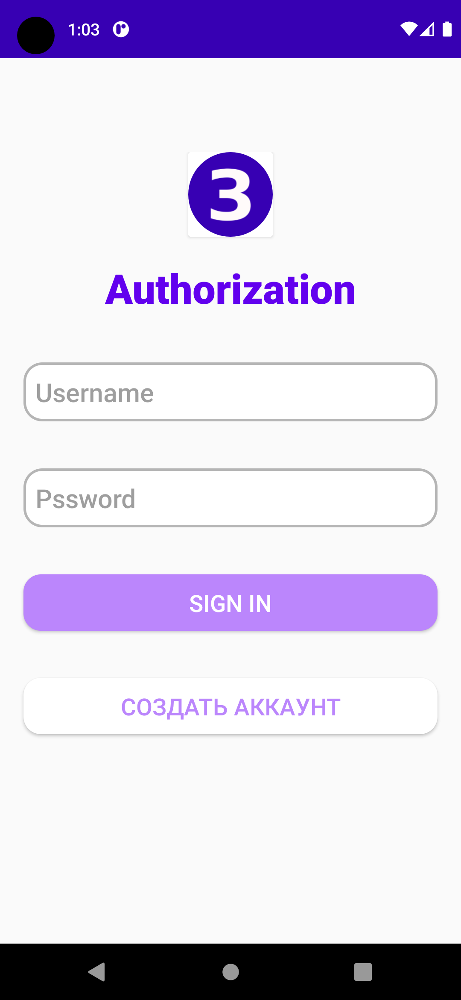
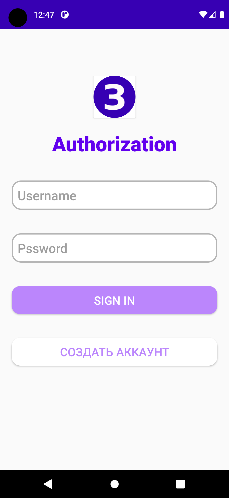
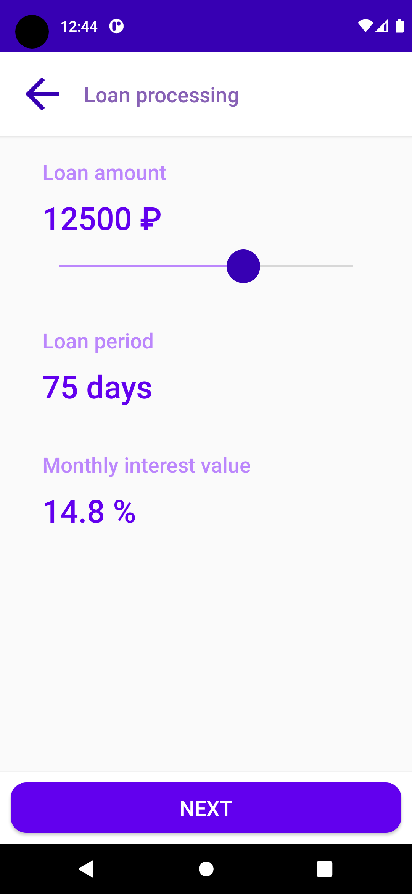
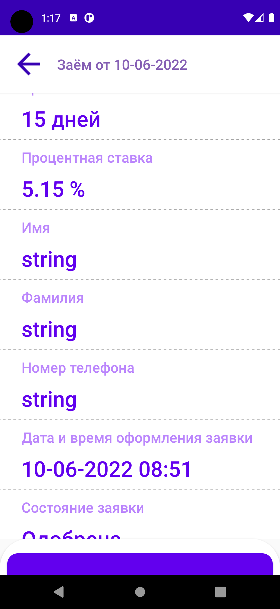

# Loan App
A Loan App exmaple. Using Kotlin Flow, Retrofit and Dagger2, etc.

## Description
An example app for applying short-term loans was made as a final task for Android Development course.

App is built according to the principles of <a href="https://blog.cleancoder.com/uncle-bob/2012/08/13/the-clean-architecture.html">Сlean architecture</a>.

MVVM is used as a design pattern.

App supports loans history caching that was made by using <a href="https://github.com/Girrafeec/example-loan-app/blob/main/app/src/main/java/com/girrafeecstud/final_loan_app_zalessky/data/repository/LoanRepositoryImpl.kt">Room</a>. That allows user to see loans history without internet connection with latest updates.

## App features
Unauthorized user may:
* Login to account
* Register with a unique name and any password (there are some data validators, so user have some data entry restrictions like using an 8 character password and etc.)

Authorized user may:
* View an instruction about how to apply for a loan
* Apply for a loan with choosed loan conditions and entered necessary data
* See the information that tells the user that loan was successfully processed
* See loans history with loans status
* Update loans history
* See detailed loan information
* Not to enter login data again if user was already authorized
* See different types of errors (HTTP errors and network errors suzh as conenction error or timeout error)

## Libraries
* <a href="https://developer.android.com/topic/libraries/architecture/lifecycle">Lifecycle</a>
* <a href="https://developer.android.com/topic/libraries/architecture/viewmodel">ViewModel</a>
* <a href="https://developer.android.com/topic/libraries/architecture/livedata">LiveData</a>
* <a href="https://github.com/square/retrofit">Retrofit2</a>
* <a href="https://developer.android.com/training/dependency-injection/dagger-android">Dagger2</a>
* <a href="https://github.com/square/okhttp">OkHttp</a>
* <a href="https://github.com/Kotlin/kotlinx.coroutines">Kotlin Coroutines</a>
* <a href="https://developer.android.com/training/data-storage/room">Room</a>

## Sceenshots
  

  

  
